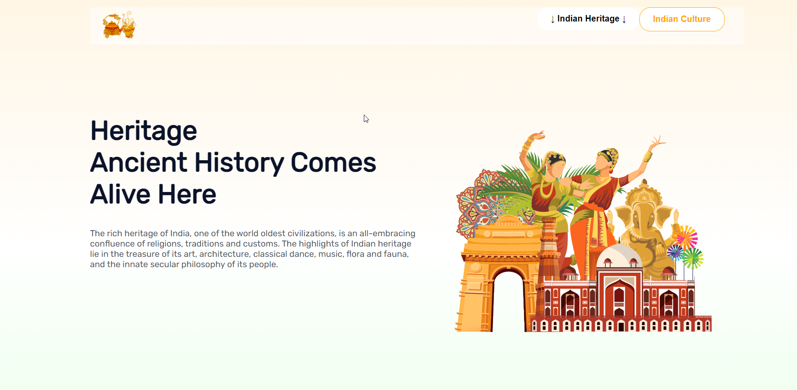

# **Indian-Culture-Heritage**

# - Project

**Indian Culture and Heritage** : It is a special number denoted by Greek symbol phi. It is simply the ratio of two quantities is equal to the ratio of sum of two quantities to the bigger quantity i.e. 1.61803398874989484820….

**Introduction** : Project shows the variety of Indian Culture and Heritage i.e. explanation of all about the Culture in Dance, Music, Cinema, Clothing etc and also have the some part showing the heritage of India in the structures and architectures.  

Website contains -:

- Home Page – All about Variety of cultures in India  (Index html page)
- Heritage Page – About the Heritage and History (How it comes in India) (Heritage html page)

**It is a responsive website. Its UI will correctly work on every device.**

**Home Page:** Home page contains the variety of Indian Culture. This page is showing that how our culture made the growth in different areas with navigation provided so that the user can easily understand.

**Heritage Page:** It contains the examples of Heritage in India and contains all about the history of things which were built in India and now they are so precious to the Indians.

**Extra Features:**
For better designing navigation in top and the carousel are added for better user interaction and carousel can work with both keyboard and mouse.

**Instructions:**

- Project contains two HTML pages - index.html(main page) and heritage.html

- Project contains css file (style.css) for styling.

- Images folder as (img1) where html pages uses those.

- HTML page contains implementation of owl carousel for carousel for using that internet is to be connect and link is provided at top of HTML page.

- OWL carousel - jquery is used for carousel in main page

